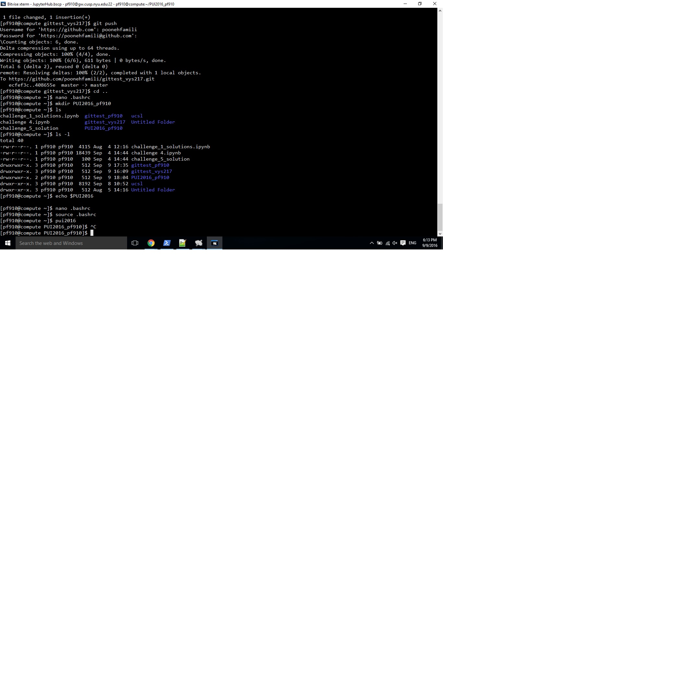
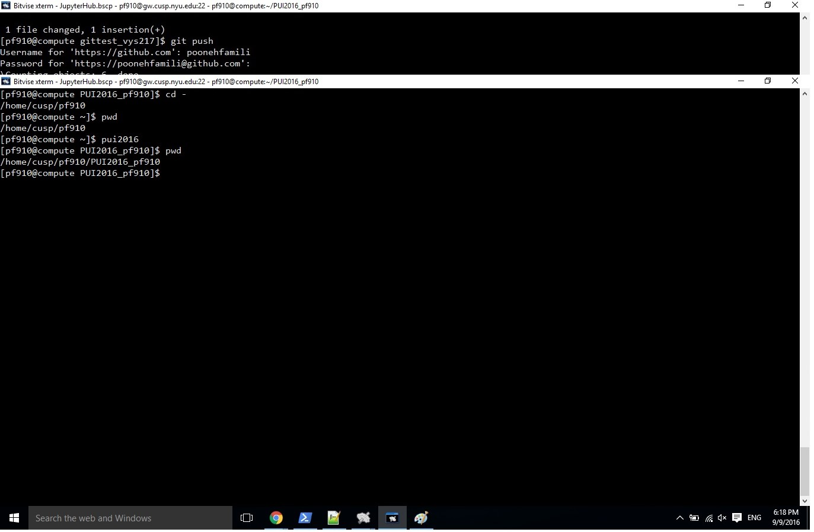
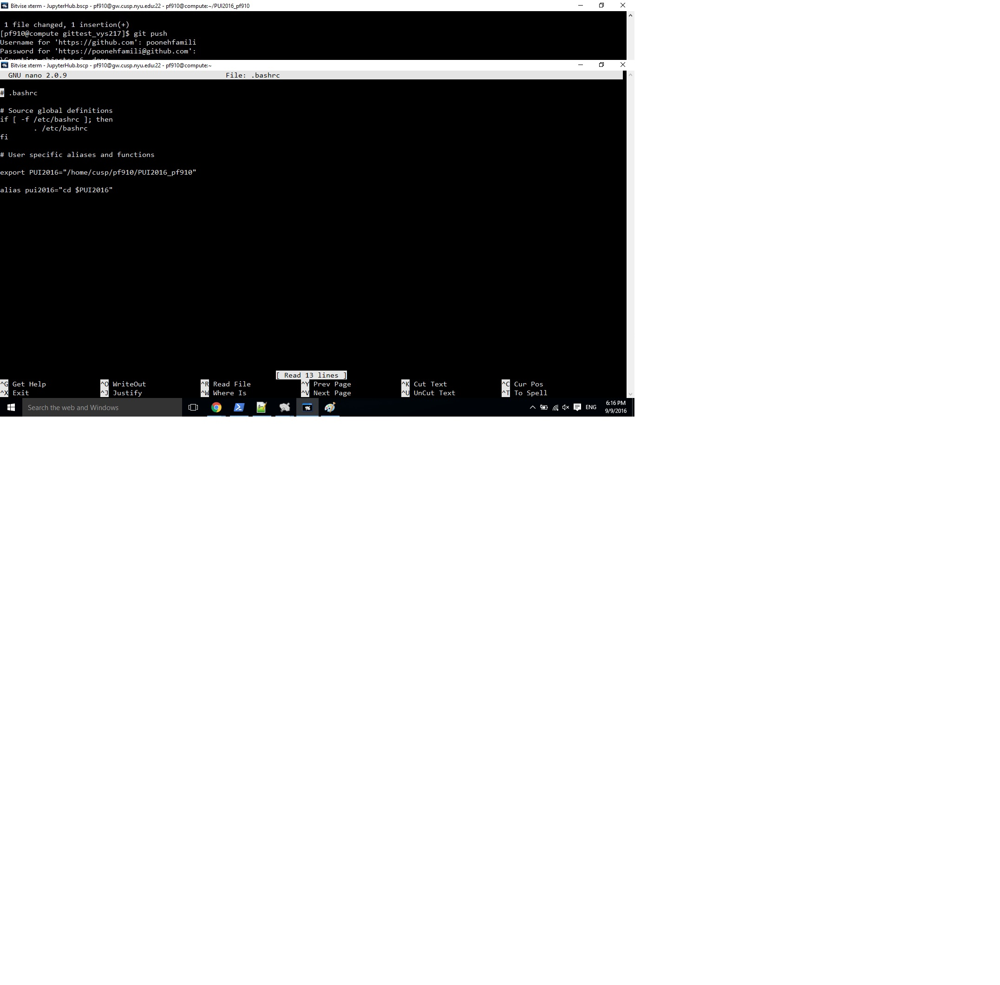

# PUI 2016 HW 1.
# Github ID: poonehfamili
### Work on a fork:
1. I forked vishelar and access to his repository: gittest_vys217 and added this statement on myfirstfile.txt: hellokjsdhafjkdfgh
2. Adrian forked me and access to adrianpoonehfile.txt in my repository: gittest_pf910 and added this line: Hello there, this is Dr Bianco messing with your file
### who helped:
Achilles Saxby helped me in uploading screen shots.
Daniel Fay helped me in learning the process.
Vishwajeet Shelar helped me in learning the process.
### What I learned till now:
How to mk dir, go to it, fork, what is add, commit, push, pull, merge, touch, echo, ...

### Screen shots:

